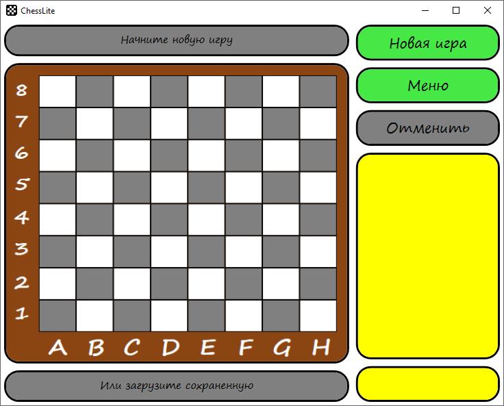
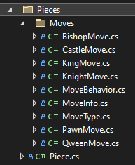
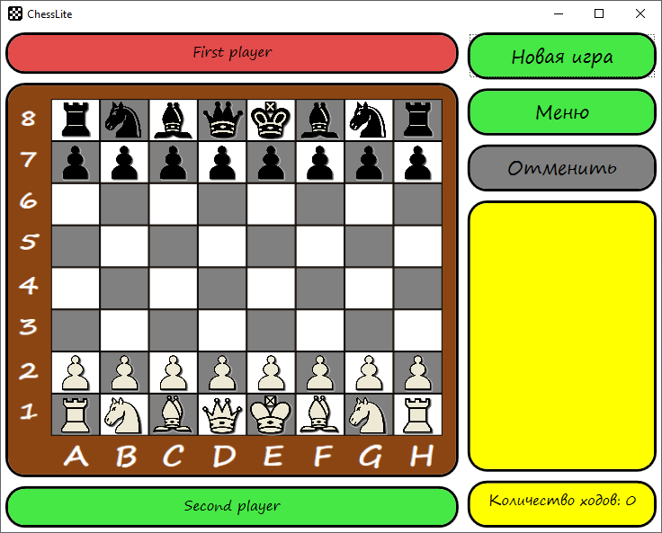
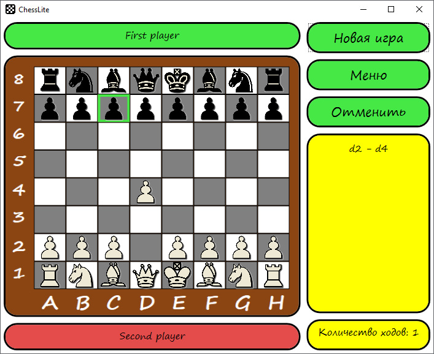
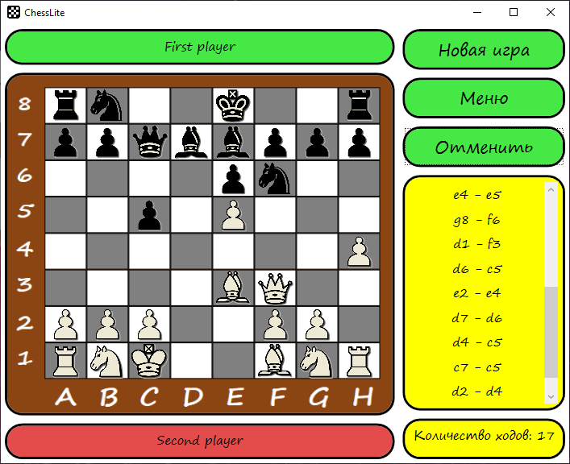
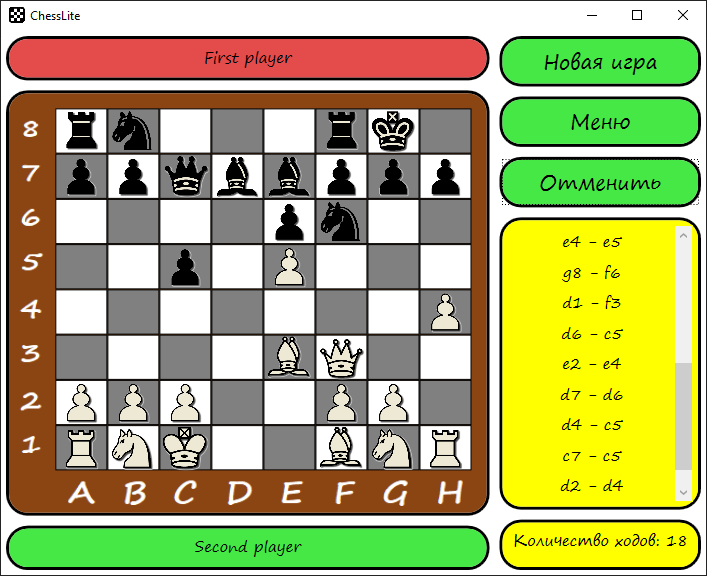
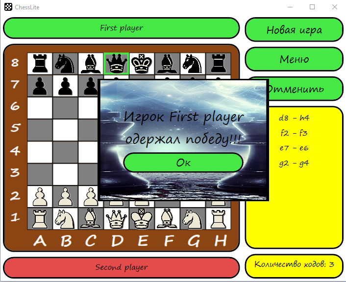
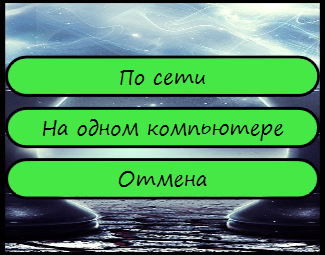
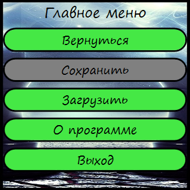

# ChessLite
Implementation of a well-known board game in the ```C#``` programming language using Microsoft's ```WPF``` technology.
The application has the ability saving and loading, cancel the move, display moves history and gaming in the local network.


Solution include two projects:
- Chess - a library describing the entire logic of the game:
  - game objects
  - the logic of the movement of pieces
  - determining the end of the game
  - storing history
  - storing the sequence of moves
  - adding and removing pieces from the game board
- ChessLite - game view implementation in the window for operation system "Windows".

## App starting view



## Code description
In project used the following technologies:
- .NET Framework 4.7.2
- WPF Framework (without MVVM)

For pieces moves in app implemented pattern ```Strategy```



## App examples

### Game beginning
Players names are displaying on the top and bottom (First player, Second player). Color around the player's name define the possibility of a move.
If the color is __green__ player can move.



### Highlight



### Roque
The application even provides the possibility of roque





### Game end
At the end of the game showed alert. Alert display game result. For example:



## Game modes



## Menu


